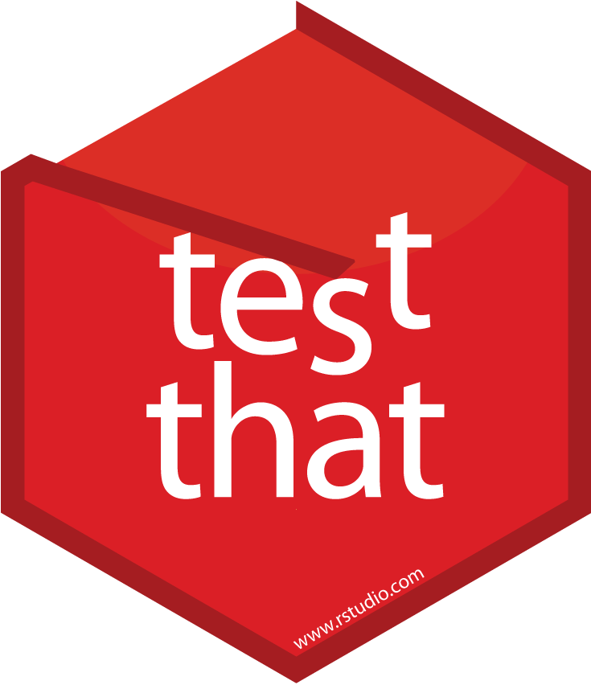
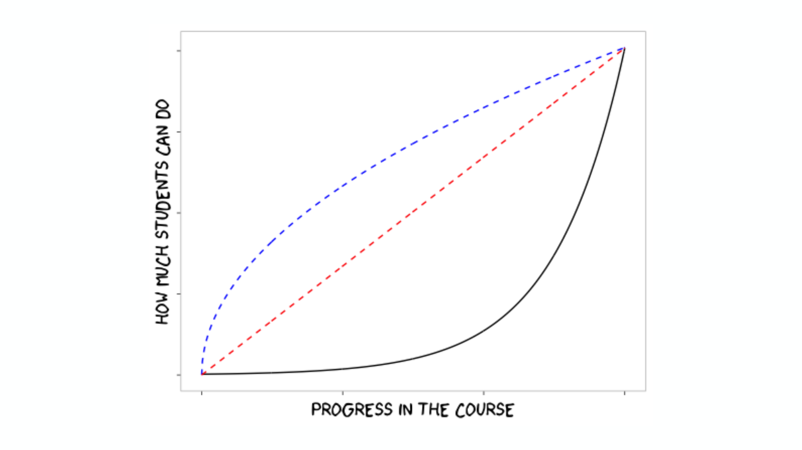
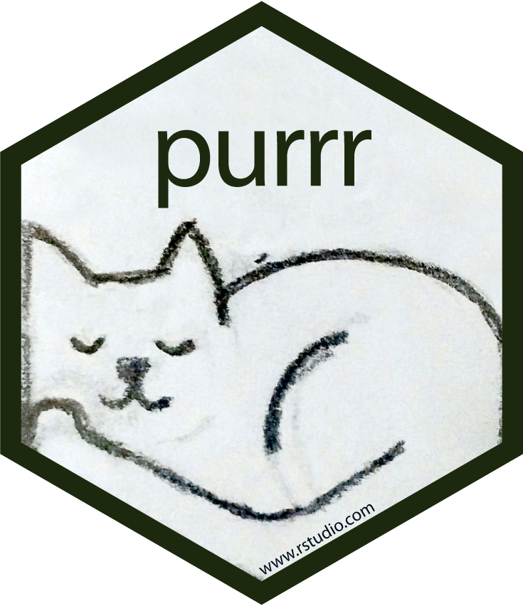

```{r setup, include=FALSE}
knitr::opts_chunk$set(echo = FALSE)
```

## RStudio::conf

 - A year of growth...
    - Inaugural RStudio::conf in 2017, ~350 attendees
    - Second RStudio::conf in 2018, >1000 attendees
 - TL;DR
    - RStudio is huge
    - I felt old
    - Coders love stickers

## Workshop 

__Jenny Bryan: "What they forgot to teach you about R"__

 - Project oriented workflow (POW)
 - "compile report" button in RStudio: reports from .R files
    - \#\# - these render in both RStudio (R code) and Markdown as comments
    - \#\' - these render as comments in R code and as regular text in Markdown.

## Jenny - Git/GitHub in R!

 - Working with the Git/GitHub interface within RStudio
     - http://happygitwithr.com
     - I (finally) admit it, a builtin Git GUI is pretty cool...
 
 - Jim Hester: searching GitHub
    - e.g., what packages are in the tidyverse core? 
    - GitHub search: "repo:tidyverse/tidyverse tidyverse_attach"
    
## Yihui Xi: xaringan package

 - New presentation package from Yihui, based on "remark"
    - remark: https://remarkjs.com/#1
    - "A simple, in-browser, Markdown-driven slideshow tool targeted at 
    people who know their way around HTML and CSS"
    
 - Yihui's package: xaringan
    - https://github.com/yihui/xaringan
    - https://slides.yihui.name/xaringan/
    - https://yihui.name/en/2017/08/why-xaringan-remark-js/
   
## Kevin Ushey - RStudio IDE

 - Terminal tab - submit code from file to terminal using `ctrl+alt+enter`
 - Object viewer: `View(x)` (e.g., ggplot object)
 - Editor themes now go across whole IDE
 - odbc package for connecting to databases
     - “connections” tab in top right RStudio window
 - Git with branches
 - Colour in the console (e.g., `library(tidyverse)` output)
 
## Winston Chang - shinytest

 - Framework for testing Shiny apps: very cool
 - Records test, and saves outputs as baseline
 - Re-run test after code or installation changes and compare results to baseline
    - diffs on outputs
    - diffs on pngs 
    
https://github.com/rstudio/shinytest

https://rstudio.github.io/shinytest/articles/shinytest.html
   
## RStudioCloud

"share, teach and learn data science using R"

 - Spaces - organised a bit like blackboard
 - Browser-based, shared RStudio user spaces
     - Loads students into personal Rstudio instance to work in.
     - Makes all files available to them (e.g., a homework assignment).
     - Goal is to make learning R and data science easier.
 - Includes links to primers, shiny-based tutorials, cheatsheets etc

https://rstudio.cloud

## Yihui Xie: BlogDown and BookDown

 - Slides: https://slides.yihui.name/2018-blogdown-rstudio-conf-Yihui-Xie.html#1
 - Yihui: ways to organise your Rmd documents 
    - `blogdown` is informal 
    - `bookdown` is formal

 - Links:
    - https://bookdown.org/yihui/blogdown/
    - https://alison.rbind.io/post/up-and-running-with-blogdown/
    - https://proquestionasker.github.io/blog/Making_Site/
    - https://www.znmeb.mobi/2017/05/12/getting-started-with-blogdown/


## Carson Sievert: Interactive graphics

 - Slides: http://cpsievert.github.io/talks/20180202
 - `crosstalk` package: results produce an HTML page that you can interact with, without the need for a web server!
    - Works with plotly.js
    - Can work without AND with shiny
   
 - Very cool visualisation of gapminder data that moves over time:
  
    https://talks.cpsievert.me/20180202/#25
    
 - RStudio `crosstalk` page:
    
    http://rstudio.github.io/crosstalk/index.html
    
    

##

<br><br><br><br><br><br>
<center>
$\huge\sf{Over~to~Murray}$
</center>

## All things rstudio

<br><br><br><br>

```{r, fig.align='right'}

```


## Motivation

```{r, fig.align='center', out.width = '70%'}
knitr::include_graphics("tidyverse/images/tidyverse_motivation.png")
```

From data to outputs

## Motivation

```{r, fig.align = 'center', out.width = "70%"}
knitr::include_graphics('tidyverse/images/01_tidyverse_data_science.png')
```

A generalised data analysis workflow

## Motivation

<center>
###Get more stuff done
</center>

- faster
- accurately
- reproducibly

## Tips and tricks

Getting to see how "the pro's" operate

## Faster

keyboard shortcut for keyboard shortcuts (alt + shift + k)


key shortcuts:

- ctrl + shift + M
- ctrl + .
- ctrl + shift + F10
- tab complete

## Faster (2)

automate the boring stuff

- usethis::create_project("/path/to/my/new/project")
- usethis::create_package("/path/to/my/new/package")

## Consistency

- data first
- prefixes
- suffixes
- plan for pipes

## Design

<center>
"It's better to optimise for comprehension speed rather than typing speed" 
<br><br><br>
"Naming things is hard work"
<br><br><br>
"Fail fast and fail hard"
</center>
<br><br>
<div align='right'>
\- Hadley Wickham
</div>

## Accurately

informal testing

- eyeball test

formal testing

- automated coded tests

```{r, fig.align='right', out.width= '30%'}

```


## Reproducibly

- data, code, text as single compiled document 
- Restart session and restart often


## Ease of access

rstudio 1.1 new features

- database connections
- extra git functionality
- terminal

## Teaching

Base R vs Tidyverse

Order matters

```{r, fig.align='right', out.width= '90%'}

```

## Things I learnt at rstudio::rconf

But wish I had known about ages ago
<br><br>

- purrr (package)
- usethis (package)
- dotfiles
- ctrl + .
- !!
- how to use the debugger

```{r, fig.align='right', out.width= '15%'}

```


    